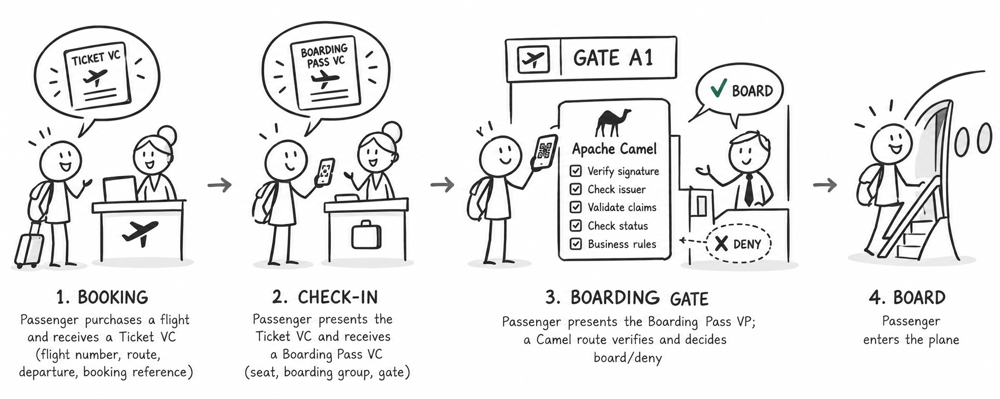

## Airport Checkin

A sample application that demonstrates the full OID4VCI → OID4VP flow in an airport boarding-gate scenario, using Apache Camel to orchestrate the verification pipeline.

A passenger first receives an Airline Ticket Credential (issued via OID4VCI at booking), then checks in and receives a Boarding Pass Credential (also issued via OID4VCI). At the gate, they present the Boarding Pass as a Verifiable Presentation. A Camel route processes the presentation through multiple verification steps and returns a board/deny decision.

## Flow

1. **Booking** — Passenger purchases a flight and receives an Airline Ticket VC (flight number, route, departure, booking reference)
2. **Check-in** — Passenger presents the Airline Ticket VC and receives a Boarding Pass VC (seat, boarding group, gate)
3. **Boarding Gate** — Passenger presents the Boarding Pass VP; a Camel route verifies and decides board/deny
4. **Board** — Passenger enters the plane
